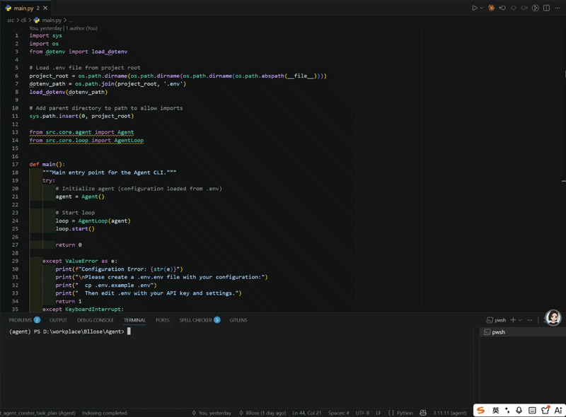
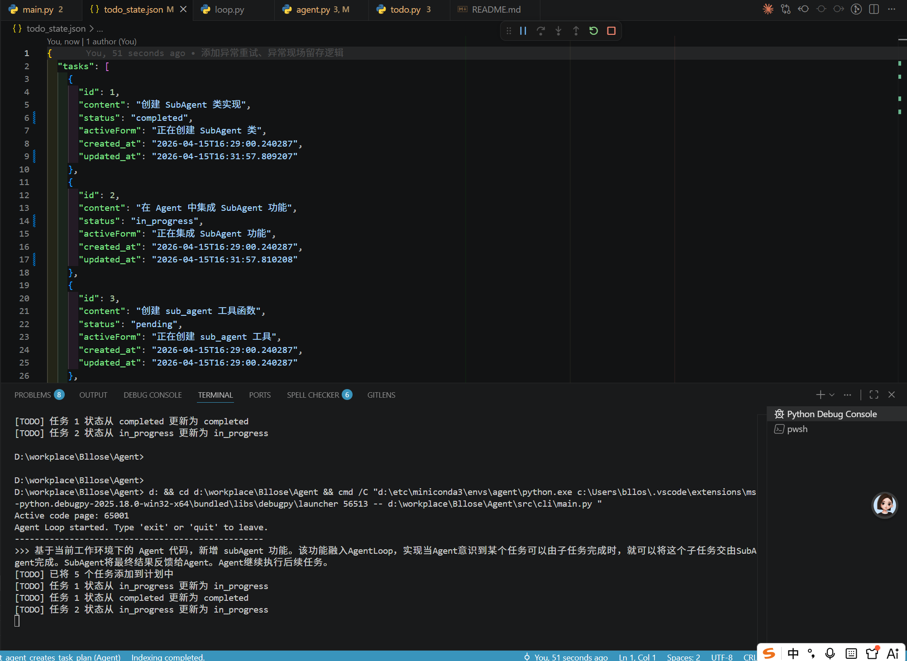

# Agent

一个智能 AI Agent 项目，类似于 Claude Code，用于辅助软件工程任务。

## ✨ 特性

- 🤖 **交互式 CLI** - 自然语言与 Agent 交互
- 🛠️ **丰富工具集** - 文件操作、命令执行、任务管理等
- 📝 **自主任务规划** - Todo 系统让 Agent 自主分解并完成复杂任务
- 🔄 **子代理协作** - SubAgent 支持并行执行独立任务
- 💾 **持久化记忆** - 保存对话历史和任务状态
- 🔌 **可扩展架构** - 支持自定义技能和插件
- 📊 **动态上下文** - 自动注入当前日期、工作目录等信息

## 🚀 快速开始

### 环境要求

- Python 3.10 或更高版本
- Anthropic API Key

### 安装

1. 克隆仓库
```bash
git clone <repository-url>
cd Agent
```

2. 安装依赖
```bash
pip install -e .
```

3. 配置环境变量
```bash
cp .env.example .env
# 编辑 .env 文件，填入你的 ANTHROPIC_API_KEY
```

4. 启动 Agent
```bash
python -m src.cli.main
```

## 📖 使用示例

### 基础工具使用

```
>>> 列出当前目录的文件
>>> 读取 README.md 的内容
>>> 创建一个打印 "Hello World" 的 Python 文件
```

### Todo 任务管理

Agent 可以自主规划并执行复杂任务：

```
>>> 帮我重构这个项目的代码结构，包括：
    1. 分析现有代码
    2. 设计新的目录结构
    3. 重构代码
    4. 更新文档
```

Agent 会自动创建任务计划并逐步执行：



### SubAgent 并行执行

当遇到可独立处理的任务时，Agent 会派生 SubAgent 并行执行：

```
>>> 扫描项目中的安全问题并修复
    - 子任务：静态分析代码漏洞
    - 子任务：检查依赖项安全性
    - 子任务：生成安全报告
```

Agent 具备自我进化和优化的能力：



## 🏗️ 项目架构

```
Agent/
├── src/
│   ├── cli/           # CLI 入口点和 REPL 循环
│   ├── core/          # 核心 Agent 逻辑
│   │   ├── agent.py   # Agent 主类
│   │   ├── loop.py    # 对话循环
│   │   └── logger.py  # 日志系统
│   ├── tools/         # 工具实现
│   │   ├── file.py    # 文件操作
│   │   ├── bash.py    # 命令执行
│   │   ├── todo.py    # 任务管理
│   │   └── sub_agent.py # 子代理
│   ├── memory/        # 持久化记忆
│   ├── skills/        # 可扩展技能
│   └── llm/           # LLM 客户端抽象层
├── templates/
│   └── system.md      # System prompt 模板
├── tests/             # 测试文件
├── docs/              # 项目文档
└── config/            # 配置文件
```

## 🛠️ 可用工具

### 文件操作
- `read_file` - 读取文件内容
- `write_file` - 写入或覆盖文件
- `edit_file` - 替换文件中的特定文本

### 系统操作
- `bash` - 执行 Shell 命令

### 任务管理
- `todo_create` - 创建任务列表
- `todo_list` - 列出所有任务
- `todo_next` - 获取下一个待处理任务
- `todo_update` - 更新任务状态
- `todo_delete` - 删除任务
- `todo_clear` - 清除所有任务
- `todo_reset_retry` - 重置任务重试次数
- `todo_status` - 获取任务详情

### 协作工具
- `sub_agent` - 派生子代理独立执行任务

## ⚙️ 配置

在 `.env` 文件中配置：

| 变量 | 说明 | 默认值 |
|------|------|--------|
| `ANTHROPIC_API_KEY` | Anthropic API 密钥 | 必填 |
| `ANTHROPIC_BASE_URL` | API 基础 URL | https://api.anthropic.com |
| `MODEL` | 使用的模型 | claude-sonnet-4-6 |
| `MAX_TOKENS` | 响应最大 token 数 | 4096 |

可用模型：
- `claude-opus-4-6`
- `claude-sonnet-4-6`
- `claude-haiku-4-5-20251001`

## 📝 开发指南

- 使用 Python 3.10+ 开发
- 遵循现有目录结构
- 新工具在 `src/tools/` 中实现
- 在 `src/tools/__init__.py` 中注册工具
- 系统提示模板在 `templates/system.md`
- 配置在 `.env` 文件中

## 🔗 相关文档

- [安装指南](INSTALL.md)
- [开发文档](CLAUDE.md)

## 📄 许可证

[LICENSE](LICENSE)
